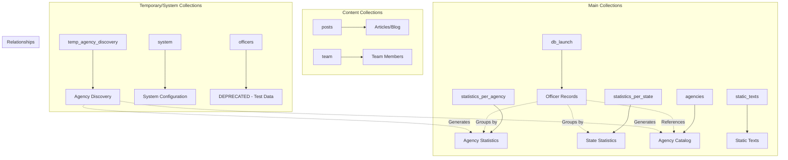

# National Police Index - Database Documentation

## General Database Structure

The National Police Index application uses **Firebase Firestore** as its NoSQL database. The structure is designed to handle police officer records, statistics by agency and state, and static application content.

## Database Architecture Diagram



## Detailed Collections

### 1. `db_launch` (Main Collection)
**Purpose**: Stores all individual police officer records.

**Document Structure**:
```typescript
interface PoliceOfficer {
  agency_name: string;           // Agency name
  current_certificate_status: string;
  document_id: string;           // Unique document ID
  end_date: string;             // End date of service
  first_name: string;
  full_name: string;
  last_name: string;
  middle_name: string;
  person_nbr: string;           // Unique person number
  rank: string;
  start_date: string;           // Start date of service
  state: string;                // State (reference)
  
  // Optional fields
  position?: string;
  status?: string;
  notes?: string;
  offense?: string;
  sanction?: string;
  violation?: string;
  sanction_date?: string;
  separation_reason?: string;
  employment_status?: string;
  certification_type?: string;
  type?: string;
  searchQueries?: string[];     // Added by scripts for search
  start_date_iso?: string;      // Normalized ISO date
  end_date_iso?: string;        // Normalized ISO date
}
```

**Scripts that use it**:
- `addSearchQueries.ts` - Adds search fields
- `addSearchQueriesAdvanced.ts` - Advanced search
- `addSearchQueriesByState.ts` - Search by state
- `normalizeDatesByState.ts` - Normalizes dates
- `normalizeStateData.ts` - Normalizes data by state
- `normalizeWashingtonData.ts` - Washington-specific normalization

**Usage in application**:
- Hook `useOfficersByUid` - Officer search by state
- Hook `useOfficersByAgency` - Officer search by agency
- Hook `useOfficerByPersonNbr` - Search by person number

### 2. `statistics_per_agency` (Agency Statistics)
**Purpose**: Stores precalculated statistics for each police agency.

**Document Structure**:
```typescript
interface AgencyStats {
  name: string;                 // Agency name
  description: string;          // Generated description
  stats: StatItem[];           // Statistics array
  state: string;               // Agency state
  last_updated: Date;          // Last update
  is_partial?: boolean;        // If data is incomplete
  pages_processed?: number;    // Pages processed during generation
  total_officers?: number;     // Total officers (direct field)
}

interface StatItem {
  label: string;               // Ex: "Total Officers", "Total Active Officers"
  value: string;               // Value as string
}
```

**Scripts that generate it**:
- `generateAgencyStats.ts` - Generates initial statistics
- `updateAgencyActiveStats.ts` - Updates active officer counts

**Usage in application**:
- Hook `useAgencyStats` - Gets agency statistics
- Hook `useOfficersByAgency` - Uses for quick counts
- Agency pages to display statistics

### 3. `statistics_per_state` (State Statistics)
**Purpose**: Stores aggregated statistics by state.

**Document Structure**:
```typescript
interface StateStats {
  title: string;               // State name
  description: string;         // Generated description
  stats: StatItem[];          // Statistics array
  last_updated: Date;         // Last update
  is_partial?: boolean;       // If data is incomplete
  pages_processed?: number;   // Pages processed
}
```

**Scripts that generate it**:
- `generateStateStats.ts` - Generates state statistics
- `generate-stats.ts` - General generation script

**Usage in application**:
- Hook `useStateStats` - Gets state statistics
- State pages to display general statistics

### 4. `agencies` (Agency Catalog)
**Purpose**: Normalized catalog of all police agencies.

**Document Structure**:
```typescript
interface AgencyData {
  name: string;                // Official agency name
  state: string;               // State (reference)
  last_updated: Timestamp;     // Last update
}
```

**Scripts that generate it**:
- `generateAgenciesCollection.ts` - Generates catalog from db_launch

**Usage in application**:
- Component `SearchFilters` - For agency autocomplete
- Function `searchAgencies` - Agency search

### 5. `static_texts` (Static Texts)
**Purpose**: Stores all static texts of the application for internationalization.

**Document Structure**:
```typescript
interface StaticText {
  id: string;                  // Unique text ID
  page: string;                // Page where it's used
  key: string;                 // Text key
  value: string;               // Text value
  description?: string;        // Usage description
  createdAt: Timestamp;
  updatedAt: Timestamp;
}
```

**Scripts that manage it**:
- `generateStaticTexts.ts` - Generates initial texts
- `importStaticTexts.ts` - Imports texts from JSON
- `exportStaticTexts.ts` - Exports texts to JSON

**Usage in application**:
- Hook `useStaticText` - Gets texts by page
- Function `getStaticText` - Gets static texts

### 6. `posts` (Articles/Blog)
**Purpose**: Stores blog articles or editorial content.

**Document Structure**:
```typescript
interface Post {
  id: string;
  title: string;
  content: string;
  excerpt?: string;
  author?: string;
  state?: string;              // If related to a state
  createdAt: Timestamp;
  updatedAt: Timestamp;
  published: boolean;
}
```

**Scripts that manage it**:
- `migrate.ts` - Initial post migration

**Usage in application**:
- Hook `usePosts` - Gets posts with filters
- Component `PostsSection` - Shows posts on main page

### 7. `team` (Team Members)
**Purpose**: Team member information for the "About" page.

**Document Structure**:
```typescript
interface TeamMember {
  name: string;
  role: string;
  image: string;               // Image URL
  description: string;
  order: number;               // Display order
  createdAt: Timestamp;
  updatedAt: Timestamp;
}
```

**Scripts that manage it**:
- `seedTeamData.ts` - Initializes team data

**Usage in application**:
- Hook `useTeam` - Gets team members
- "About" page to display team

## Temporary and System Collections

### 8. `temp_agency_discovery` (Temporary)
**Purpose**: Temporary collection to discover unique agencies during statistics generation.

**Document Structure**:
```typescript
interface TempAgency {
  name: string;                // Agency name
  state: string;               // State
  discovered_at: Date;         // Discovery date
}
```

**Scripts that use it**:
- `generateAgencyStats.ts` - To avoid duplicates during processing

### 9. `system` (System Configuration)
**Purpose**: Stores system configuration and state.

**Known documents**:
- `static_texts_version` - Static texts version
- `active_stats_progress` - Active statistics update progress

**Scripts that use it**:
- `generateStaticTexts.ts` - Updates text version
- `updateAgencyActiveStats.ts` - Saves processing progress

## Deprecated Collections

### 10. `officers` ⚠️ **DEPRECATED**
**Purpose**: Test collection for officers (not used in production).

**Scripts that use it**:
- `seedOfficers.ts` - Test script (deprecated)

**Status**: This collection is not used in the current application. Real data is in `db_launch`.

## Access Patterns and Queries

### Main Queries by Collection

1. **db_launch**:
   - By state: `where('state', '==', stateRef)`
   - By agency: `where('agency_name', '==', agencyName)`
   - By person: `where('document_id', '==', personNbr)`
   - Active officers: `where('end_date', '==', '')`
   - Text search: `where('searchQueries', 'array-contains-any', terms)`

2. **statistics_per_agency**:
   - By agency and state: `where('name', '==', agencyName) && where('state', '==', state)`
   - By state: `where('state', '==', stateRef)`

3. **statistics_per_state**:
   - By document ID (state): `doc(collection, stateRef)`

### Recommended Indexes

To optimize queries, the following composite indexes are recommended:

```
db_launch:
- (state, agency_name)
- (agency_name, start_date)
- (agency_name, end_date)
- (state, start_date)
- (state, end_date)
- (searchQueries, state)

statistics_per_agency:
- (state, name)
- (name, state)
```

## Maintenance Scripts

### Active Scripts
- `generateAgencyStats.ts` - Generates/updates agency statistics
- `generateStateStats.ts` - Generates/updates state statistics
- `updateAgencyActiveStats.ts` - Updates active officer counts
- `generateAgenciesCollection.ts` - Regenerates agency catalog
- `addSearchQueriesByState.ts` - Adds search fields by state

### Normalization Scripts
- `normalizeDatesByState.ts` - Normalizes dates by state
- `normalizeStateData.ts` - Normalizes general data by state
- `normalizeWashingtonData.ts` - Washington-specific normalization

### Content Scripts
- `generateStaticTexts.ts` - Generates static texts
- `importStaticTexts.ts` - Imports texts from files
- `exportStaticTexts.ts` - Exports texts to files
- `seedTeamData.ts` - Initializes team data

### Deprecated Scripts ⚠️
- `seedOfficers.ts` - Test data (do not use in production)
- `migrate.ts` - Initial migration (one-time use)
- `addSearchQueries.ts` - Replaced by more specific versions
- `addSearchQueriesAdvanced.ts` - Functionality integrated into other scripts

## Performance Considerations

1. **Pagination**: Cursor-based pagination is used for large collections
2. **Cache**: Hooks implement local cache to avoid repeated queries
3. **Batch Operations**: Scripts use batch writes for bulk operations
4. **Query Limits**: Firestore limits are respected (500 writes per batch)
5. **Garbage Collection**: Long-running scripts implement manual GC

## Security and Access

- **Read**: All main collections are read-only for users
- **Write**: Only administrative scripts can write data
- **Indexes**: Configured to optimize read queries
- **Firestore Rules**: Configured for public read access, restricted write

## Monitoring and Maintenance

1. **Logs**: All scripts generate detailed logs
2. **Progress**: Long scripts save progress in the `system` collection
3. **Retries**: Implemented for operations that may fail
4. **Timeouts**: Configured to avoid hanging operations
5. **Metrics**: Performance and error tracking in scripts

---

*Last updated: November 2025*
